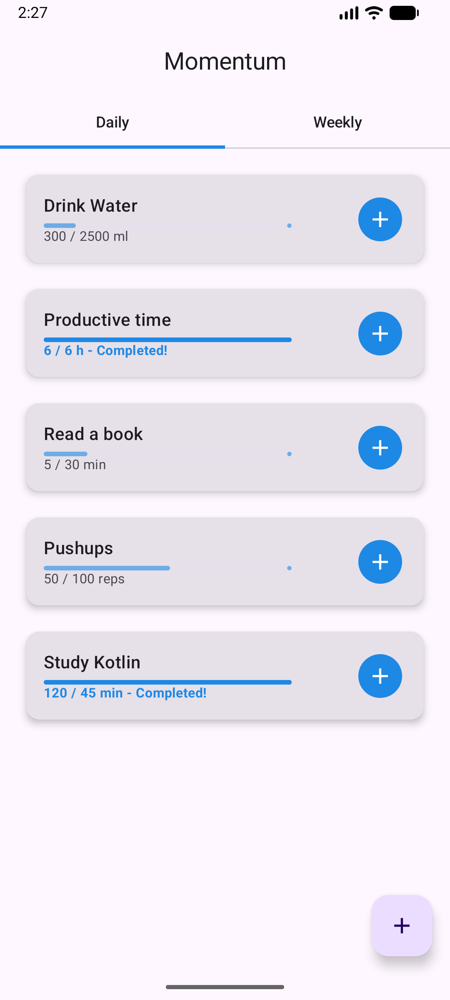
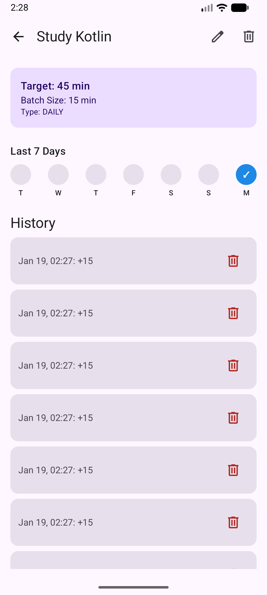
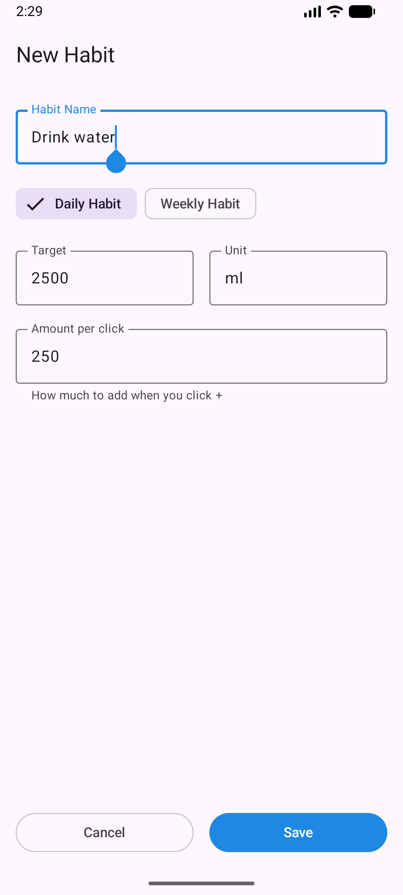

# Momentum - Habit Tracker

Momentum is a modern, minimalist Android application built to help users build and maintain positive habits. It focuses on simplicity and consistency, offering tools to track daily and weekly goals with instant visual feedback.

Built with **Kotlin** and **Jetpack Compose**, it follows modern Android development practices including the MVVM architecture and Room for local data persistence.

## 📱 Features

* **Customizable Habits:** Create habits with specific targets (e.g., "Drink 2500ml Water", "Read 30 mins").
* **Daily & Weekly Goals:** Support for different habit frequencies to match your lifestyle.
* **Smart Tracking:** Quick "+" button to log progress in batches.
* **Visual Feedback:**
  * Dynamic progress bars that change color upon completion.
  * **History Strip:** A visual "streak" indicator showing the last 7 days/weeks.
* **Full History Management:**
  * Undo accidental entries.
  * View detailed history logs.
  * Edit habit details (Name, Target, Batch Size).
* **Modern UI:** Clean, Material 3 design with support for Dark Mode.

## 🛠 Tech Stack

* **Language:** Kotlin
* **UI Framework:** [Jetpack Compose](https://developer.android.com/jetpack/compose) (Material 3)
* **Architecture:** MVVM (Model-View-ViewModel)
* **Local Database:** [Room](https://developer.android.com/training/data-storage/room) (SQLite abstraction)
* **Concurrency:** Kotlin Coroutines & Flow
* **Navigation:** Jetpack Navigation Compose
* **Dependency Injection:** Manual Injection (ViewModelFactory)

## 📂 Project Structure

The project is organized using a **Package by Layer** structure for better scalability and maintainability:

```text
cz.janfranek.momentum
├── data              # Database & Data Models
│   ├── Habit.kt
│   ├── HabitEntry.kt
│   ├── HabitDao.kt
│   └── MomentumDatabase.kt
├── ui                # User Interface Layer
│   ├── components    # Reusable UI widgets (HabitCard, HistoryStrip, etc.)
│   ├── screens       # Full-screen composables (Dashboard, Detail, Add)
│   ├── theme         # App branding (Color, Type, Theme)
│   └── viewmodel     # State management & Business Logic
├── MainActivity.kt   # Entry point
└── MomentumApp.kt    # Navigation Host

```

## 🚀 How to Run

1. **Clone the repository:**

   ```bash
   git clone https://github.com/jan-franek/momentum.git
   ```

2. **Open in Android Studio:**
   * Open Android Studio and select "Open".
   * Navigate to the cloned folder.

3. **Sync Gradle:**
   * Allow Android Studio to download the necessary dependencies.

4. **Run:**
   * Connect an Android device or start an Emulator.
   * Press **Run** (Shift+F10).

## 📸 Screenshots



## 🔧 Future work

* Custom push notifications
* Prettify the dashboard
* Option to backup data to cloud
* Once-a-day batch job to keep better data for statistics since Target can change thus "Completed" task for the day is relative
  * Better visualize historic data
* More habit types
  * Simple boolean habits
  * Timed habits with and in-app timer
  * "Negative" habits
* More habit properties
  * Habit priority
  * Minimal/optimal target
* Dashboard filter and custom ordering
* Option to modify historic data
* Aggregate habit entries entered at the same time (to save db space)

## 📄 License

This project is licensed under the MIT License - see the [LICENSE](LICENSE) file for details.

**Acknowledgments:**

* App icons and UI elements are from [Google Material Icons](https://fonts.google.com/icons), licensed under the [Apache License 2.0](https://www.apache.org/licenses/LICENSE-2.0).
